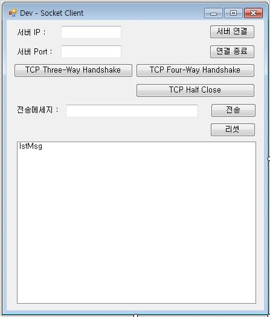

# SocketServerClientEXE
TCP Socket Client EXE
TCP Socket Server EXE

## 1. 프로젝트 정보 및 버젼

### *[ TCPIPSocketClient Solution ]	
### *[ TCPIPSocketClient csproj ]	

| 프로젝트 | 설명 | .NET버젼 | TCPIPSocketClient버젼 |
| -------- | -------- | -------- | -------- |
| TCPIPSocketClient | Socket Client | .NET 3.5	| TCPIPSocketClient.exe 1.0.0.0 |

### *[ TCPIPSocketServer Solution ]	
### *[ TCPIPSocketServer csproj ]	

| 프로젝트 | 설명 | .NET버젼 | TCPIPSocketServer버젼 |
| -------- | -------- | -------- | -------- |
| TCPIPSocketServer | Socket Client | .NET 3.5	| TCPIPSocketServer.exe 1.0.0.0 |

## 2. 프로젝트 정보 및 참조
- System.IO;
- System.Net;
- System.Net.Sockets;
- System.Threading;
- System.Collections;

## 3. 참고 정보
- https://docs.microsoft.com/en-us/dotnet/api/system.net.sockets.socket?view=netframework-4.8
- https://docs.microsoft.com/en-us/dotnet/api/system.net.sockets.tcpclient?view=netframework-4.8

## 4. 샘플

